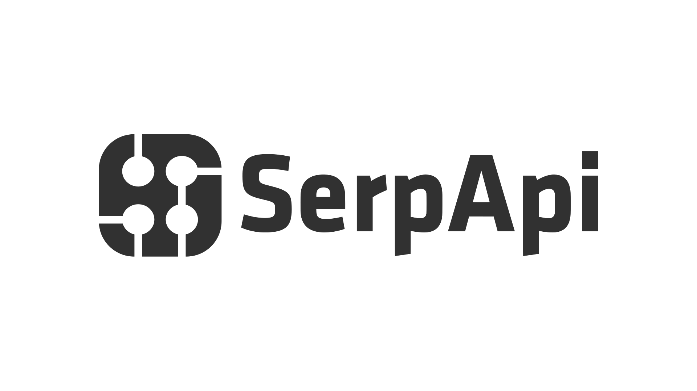

<p align="center"></p>

<h1 align="center">MarkWeave</h1>

<div align="center">
  <a href="https://twitter.com/intent/tweet?via=markweaveme&url=https://github.com/markweave/markweave/&text=What%20do%20you%20want%20to%20say%20to%20app?&hashtags=happyMarkWeave">
    
  </a>
</div>
<div align="center">
  <strong>:high_brightness: Next generation markdown editor :crescent_moon:</strong><br>
  A simple and elegant open-source markdown editor that focused on speed and usability.<br>
  <sub>Available for Linux, macOS and Windows.</sub>
</div>

<br>

<div align="center">
  <!-- License -->
  <a href="LICENSE">
    
  </a>
  <!-- Downloads total -->
  <a href="https://github.com/markweave/markweave/releases">
    
  </a>
  <!-- Downloads latest release -->
  <a href="https://github.com/markweave/markweave/releases/latest">
    
  </a>
  <!-- sponsors -->
  <a href="https://opencollective.com/markweave">
    
  </a>
</div>

<div align="center">
  <h3>
    <a href="https://github.com/markweave/markweave">
      Website
    </a>
    <span> | </span>
    <a href="https://github.com/markweave/markweave#features">
      Features
    </a>
    <span> | </span>
    <a href="https://github.com/markweave/markweave#download-and-installation">
      Downloads
    </a>
    <span> | </span>
    <a href="https://github.com/markweave/markweave#development">
      Development
    </a>
    <span> | </span>
    <a href="https://github.com/markweave/markweave#contribution">
      Contribution
    </a>
  </h3>
</div>

<div align="center">
  <sub>Translations:</sub>
  <a href="docs/i18n/README-zh_cn.md#readme">
    <span>:cn:</span>
  </a>
  <a href="docs/i18n/README-zh_tw.md#readme">
    <span>:taiwan:</span>
  </a>
  <a href="docs/i18n/README-jp.md#readme">
    <span>:jp:</span>
  </a>
  <a href="docs/i18n/README-fr.md#readme">
    <span>:fr:</span>
  </a>
  <a href="docs/i18n/README-tr.md#readme">
    <span>:tr:</span>
  </a>
  <a href="docs/i18n/README-es.md#readme">
    <span>:es:</span>
  </a>
  <a href="docs/i18n/README-pt.md#readme">
    <span>:portugal:</span>
  </a>
  <a href="docs/i18n/README-kr.md#readme">
    <span>:kr:</span>
  </a>
  <a href="docs/i18n/README-bn.md#readme">
    <span>:bangladesh:</span>
  </a>
</div>

<div align="center">
  <sub>This Markdown editor that could. Built with ❤︎ by
    <a href="https://github.com/Jocs">Jocs</a> and
    <a href="https://github.com/markweave/markweave/graphs/contributors">
      contributors
    </a>
    .
  </sub>
</div>

<br />

<h2 align="center">Sponsors</h2>

MarkWeave is an open-source Markdown editor powered by the support of its community. If MarkWeave improves your workflow, please consider [sponsoring the project](https://github.com/sponsors/markweave). Thank you to all the sponsors ❤️

**Special Sponsor**

| [](https://serpapi.com/?utm_source=markweave) | [Scrape Google and other search engines from our fast, easy, and complete API.](https://serpapi.com/?utm_source=markweave) |
| ------------- |:-------------|
| [](https://www.ukey.com) | [Secure hardware wallet made simple.](https://www.ukey.com) |

## Screenshot


## Features

- Realtime preview (WYSIWYG) and a clean and simple interface to get a distraction-free writing experience.
- Support [CommonMark Spec](https://spec.commonmark.org), [GitHub Flavored Markdown Spec](https://github.github.com/gfm/) and selective support [Pandoc markdown](https://pandoc.org/MANUAL.html#pandocs-markdown).
- Markdown extensions such as math expressions (KaTeX), front matter and emojis.
- Support paragraphs and inline style shortcuts to improve your writing efficiency.
- Output **HTML** and **PDF** files.
- Various [themes](https://markweave.me/docs/themes): **Cadmium Light**, **Material Dark** etc.
- Various editing modes: **Source Code mode**, **Typewriter mode**, **Focus mode**.
- Paste images directly from clipboard.

## Download and Installation


|                                                                                          |                                                                                          |                                                                                                        |
|:-------------------------------------------------------------------------------------------------------------------------------------------------------------------------------------------:|:-----------------------------------------------------------------------------------------------------------------------------------------------------------------------------------------------:|:-----------------------------------------------------------------------------------------------------------------------------------------------------------------------------------------------------------:|
| [](https://github.com/markweave/markweave/releases/latest) | [](https://github.com/markweave/markweave/releases/latest) | [](https://github.com/markweave/markweave/releases/latest) |

Want to see new features of the latest version? Please refer to [CHANGELOG](https://markweave.me/docs/changelog).

#### macOS

Requires macOS 11 (Big Sur) or later. Universal builds aren't published — pick the matching `arm64` or `x64` installer.

You can either download the latest `markweave-mac-(arm64|x64)-%version%.dmg` from the [release page](https://github.com/markweave/markweave/releases/latest) or install MarkWeave using [**homebrew cask**](https://github.com/caskroom/homebrew-cask). To use Homebrew-Cask you just need to have [Homebrew](https://brew.sh/) installed.

```bash
brew install --cask mark-text
```

#### Windows

Requires Windows 10 or 11. Both x64 and arm64 installers are published — pick the architecture that matches your machine.

Simply download and install MarkWeave via the setup wizard (`markweave-win-(x64|arm64)-%version%-setup.exe`) and choose whether to install per-user or machine wide. Alternatively, install MarkWeave using a package manager such as [Chocolatey](https://chocolatey.org/) or [Winget](https://docs.microsoft.com/en-us/windows/package-manager/winget/).

To use Chocolatey, you need to have [Chocolatey](https://chocolatey.org/install) installed:

```bash
choco install markweave
```

To use Winget, you need to have [Winget](https://docs.microsoft.com/en-us/windows/package-manager/winget/#install-winget) installed:

```bash
winget install markweave
```

#### Linux

Please follow the [Linux installation instructions](https://markweave.me/docs/installation).

#### Other

All binaries for Linux, macOS and Windows can be downloaded from the [release page](https://github.com/markweave/markweave/releases/latest). If a version is unavailable for your system, then please open an [issue](https://github.com/markweave/markweave/issues).

## Development

If you wish to build MarkWeave yourself, please check out our [build instructions](https://markweave.me/docs/dev/build).

- [User documentation](https://markweave.me/docs/introduction)
- [Developer documentation](https://markweave.me/docs/dev/overview)

If you have any questions regarding MarkWeave, you are welcome to write an issue. When doing so please use the default format found when opening an issue. Of course, if you submit a PR directly, it will be greatly appreciated.

## Contribution

MarkWeave is in development, please make sure to read the [Contributing Guide](.github/CONTRIBUTING.md) before making a pull request. Want to add some features to MarkWeave? Refer to our [roadmap](https://github.com/markweave/markweave/projects) and open issues.

## Contributors

Thank you to all the people who have already contributed to MarkWeave[[contributors](https://github.com/markweave/markweave/graphs/contributors)].

<a href="https://github.com/markweave/markweave/graphs/contributors"></a>

## License

[**MIT**](LICENSE).
